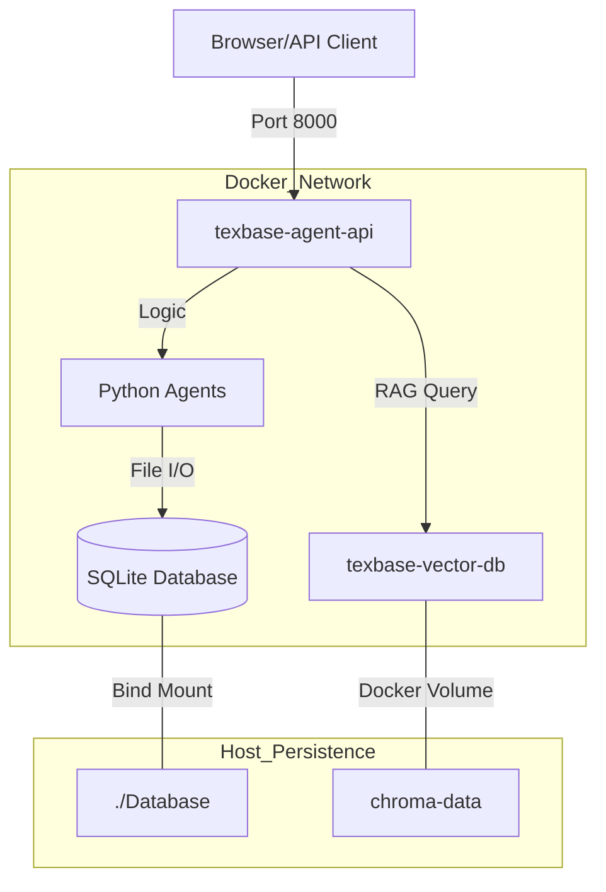

# TEXBase Multi-Agent System: Docker Implementation Report

This document provides a deep-dive technical analysis of the Docker infrastructure used in the TEXBase project. It explains the design philosophy, component-level details, and operational workflows.

---

## 1. Architectural Strategy: The Layered Build Model
The project implements a **Two-Stage Layered Build Strategy**. This is designed to optimize development speed while handling heavy AI dependencies.

### 1.1 Dockerfile.base (The Dependency Foundation)
This file creates the `texbase-libs` image. It is the "heavy" layer that rarely changes.
*   **Purpose:** Pre-installs all massive libraries (PyTorch, Playwright, LangChain).
*   **Key Logic:**
    *   **System Deps:** Installs `python3`, `pip`, and `build-essential`.
    *   **Python Venv:** Creates an isolated environment in `/opt/venv` to avoid system-level library conflicts.
    *   **Torch Optimization:** Installs `torch` with the `--index-url https://download.pytorch.org/whl/cpu` flag. This saves ~2GB of space by omitting unnecessary GPU drivers.
    *   **Browser Pre-baking:** Runs `playwright install --with-deps chromium` so that the 500MB browser binary is cached in the image.
    *   **Node Rebuild:** Rebuilds `sqlite3` inside the container to ensure the binary is compatible with the Linux kernel (standard Mac `node_modules` won't work).

### 1.2 Dockerfile (The Application Layer)
This is the "lightweight" image used for daily development.
*   **Purpose:** Copies source code and defines the runtime execution.
*   **Key Logic:**
    *   **Inheritance:** Uses `FROM texbase-libs` to instantly gain access to all dependencies.
    *   **Environment Variables:** Sets `WORKSPACE_ROOT=/app` and `PYTHON_EXE=/opt/venv/bin/python3`. This ensures the Node.js backend knows exactly where the database and Python agents are located.
    *   **Health Check:** Uses `HEALTHCHECK` to ping the API every 30 seconds. If the container becomes unresponsive, Docker marks it as "unhealthy" and can trigger an auto-restart.

---

## 2. Service Orchestration (docker-compose.yml)
The system is divided into two primary services that communicate over a private Docker network.

| Service | Role | Key Configuration |
| :--- | :--- | :--- |
| **agent-api** | Node.js Backend + Python Agents | Maps port `8000`. Uses a **Bind Mount** for `./Database` to ensure SQLite data persists on your Mac. |
| **vector-db** | ChromaDB (Vector Search) | Uses the official `chromadb/chroma` image. Maps internal port `8000` to external `8003` to avoid conflicts. |

### 2.1 Data Persistence Logic
*   **SQLite Persistence:** The mapping `./Database:/app/Database` means that when an agent writes a new entry to the database, the file is updated directly on your host machine.
*   **Vector Persistence:** Uses a **Named Volume** `chroma-data`. This is managed by Docker and is optimized for the high-speed I/O required by vector embeddings.

---

## 3. Optimization and Security (.dockerignore)
The `.dockerignore` file ensures the build process is fast and secure by excluding:
1.  **Massive Assets:** `**/local_qwen_model` (3.5GB+) is ignored because it's too large to be efficiently packaged in a container image.
2.  **Conflicting Binaries:** Local `node_modules` and `venv` folders are ignored because they contain Mac-specific files that would crash the Linux container.
3.  **Secrets:** `.env` and `Google Credentials` are excluded to prevent private API keys from being permanently stored in the Docker image history.

---

## 4. Visual Architecture Diagram

---

## 5. Summary of Implementation Benefits
*   **Consistency:** "Works on my machine" is guaranteed because the container provides a locked-down Linux environment.
*   **Performance:** By using the base image strategy, app updates take less than 5 seconds to build.
*   **Safety:** Volume mapping ensures that even if you delete your Docker containers, your email logs, company data, and vector embeddings remain safe on your SSD.
